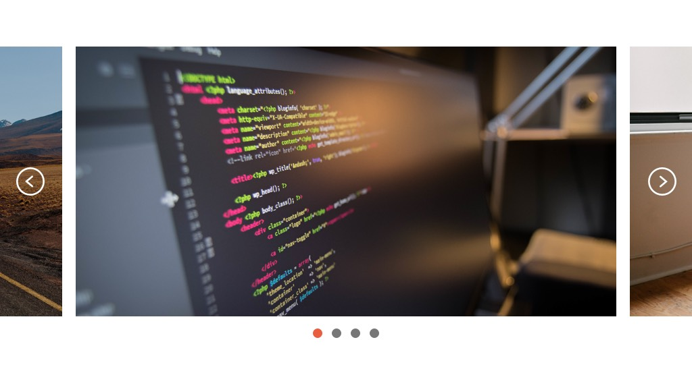

# Carousel

Fork [this Code Pen](http://codepen.io/LukeAskew/pen/ONXZQG) and finish coding the carousel match the design above.

The Code Pen is partially setup. It uses [Owl Carousel](http://smashingboxes.github.io/OwlCarousel2/), [jQuery](http://jquery.com/), and [Sass](http://sass-lang.com/). Use these tools to complete the challenge.

Carousel images are already in place. SVGs for navigation arrows are provided in this repo.

When completed, send us a link to the forked pen.
